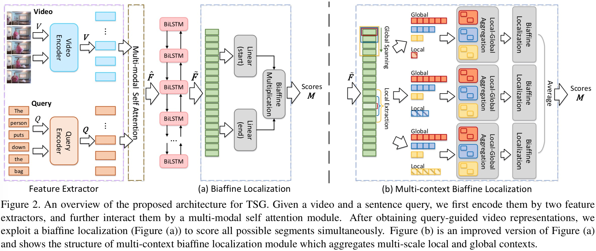
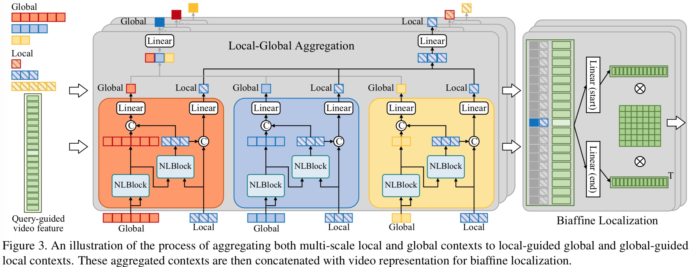

# CBLN 
Code for CVPR 2021 paper (coming soon):  
**Context-aware Biaffine Localizing Network for Temporal Sentence Grounding**  
[Daizong Liu](https://liudaizong.github.io/HomePage/), Xiaoye Qu, Jianfeng Dong, Pan Zhou, Yu Cheng, Wei Wei, Zichuan Xu, Yulai Xie
CVPR 2021  
[[paper](https://arxiv.org/pdf/2103.11555.pdf)]

## Introduction
**Overview of the proposed method:**  

**Architecture of the biaffine module:**  

## Citation
If you  find this code useful for your research, please consider citing the following paper:

    @inproceedings{liu2021context,
      title={Context-aware Biaffine Localizing Network for Temporal Sentence Grounding},
      author={Liu, Daizong and Qu, Xiaoye and Dong, Jianfeng and Zhou, Pan and Cheng, Yu and Wei, Wei and Xu, Zichuan and Xie, Yulai},
      booktitle={Proceedings of the IEEE/CVF Conference on Computer Vision and Pattern Recognition (CVPR},
      pages={11235--11244},
      year={2021}
    }

## Acknowledgements
This code borrows several code from [biaffine-ner](https://github.com/juntaoy/biaffine-ner). We gratefully appreciate the impact these libraries had on our work. If you use our code, please consider citing the original papers as well.
